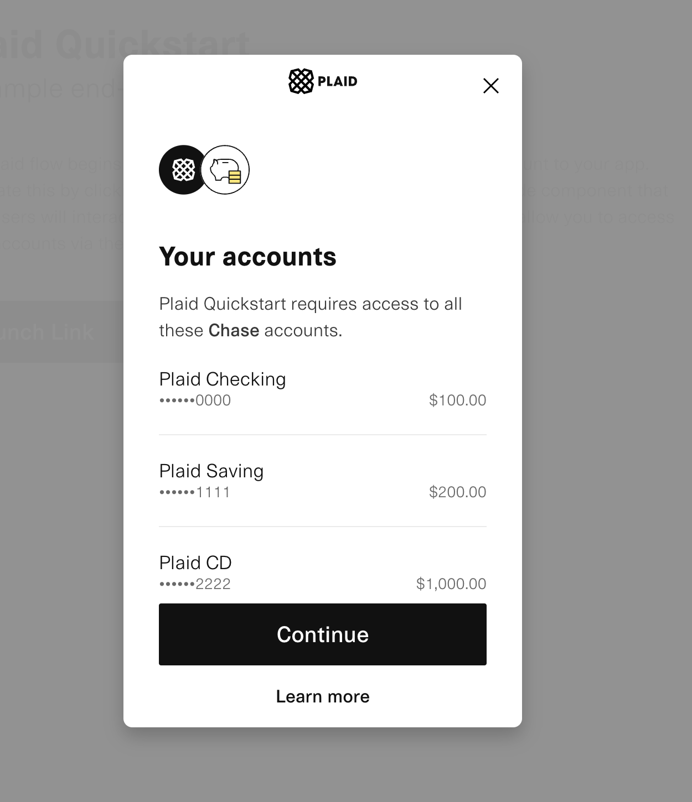
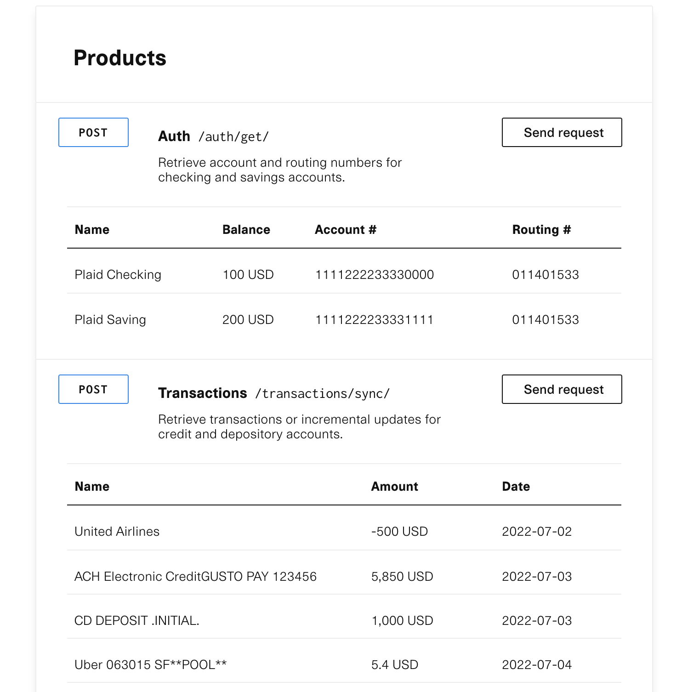

# go-plaid
[Plaid](https://plaid.com//) is a safe way for apps to connect to financial accounts. To understand what they can offer better, this is a toy app to demonstrate some features of plaid APIs. Of course what `Plaid` can provide is way more than what are demonstrated here but hopefully this app could give you a sense about their business ambitions.

# plaid API features to demostrate
- [x] plaid link to allow user to log in their bank account safely
- [x] account operations such as checking account balance after successful authentication

# screenshots
## sample accounts

## fetched transactions of account


# notes about this app
- [x] this app is built on top of [simple-gço-server](https://github.com/uitachi123/simple-go-server) which is a working scaffolding of `golang` server with `react` UI
- [x] app is ready to run with your plaid API token
- [x] the development of this app refers to plaid docs [quickstart](https://plaid.com/docs/quickstart/#how-it-works)

# clean, test, build
```
make all
```

# run
PLAID_SECRET=`your plaid API Secret` PLAID_CLIENT_ID=`your plaid Client ID` make serve

# testing login
[sandbox testing credentials](https://plaid.com/docs/quickstart/#sandbox-credentials)
